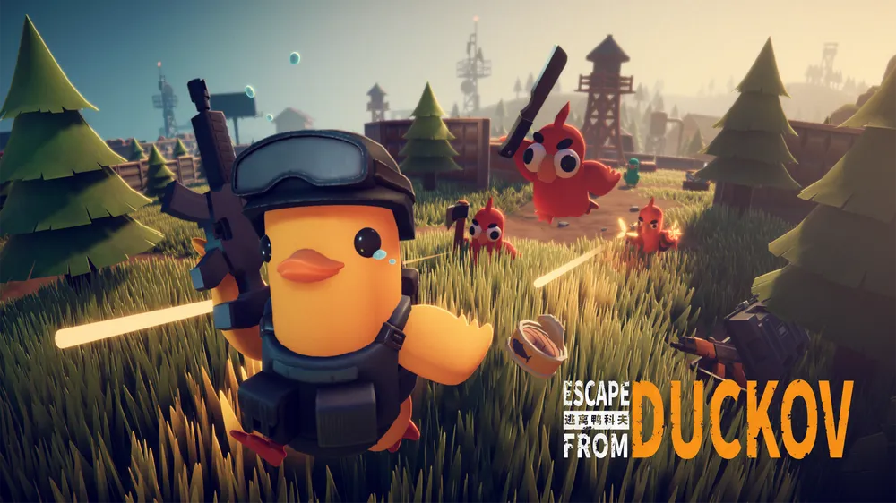
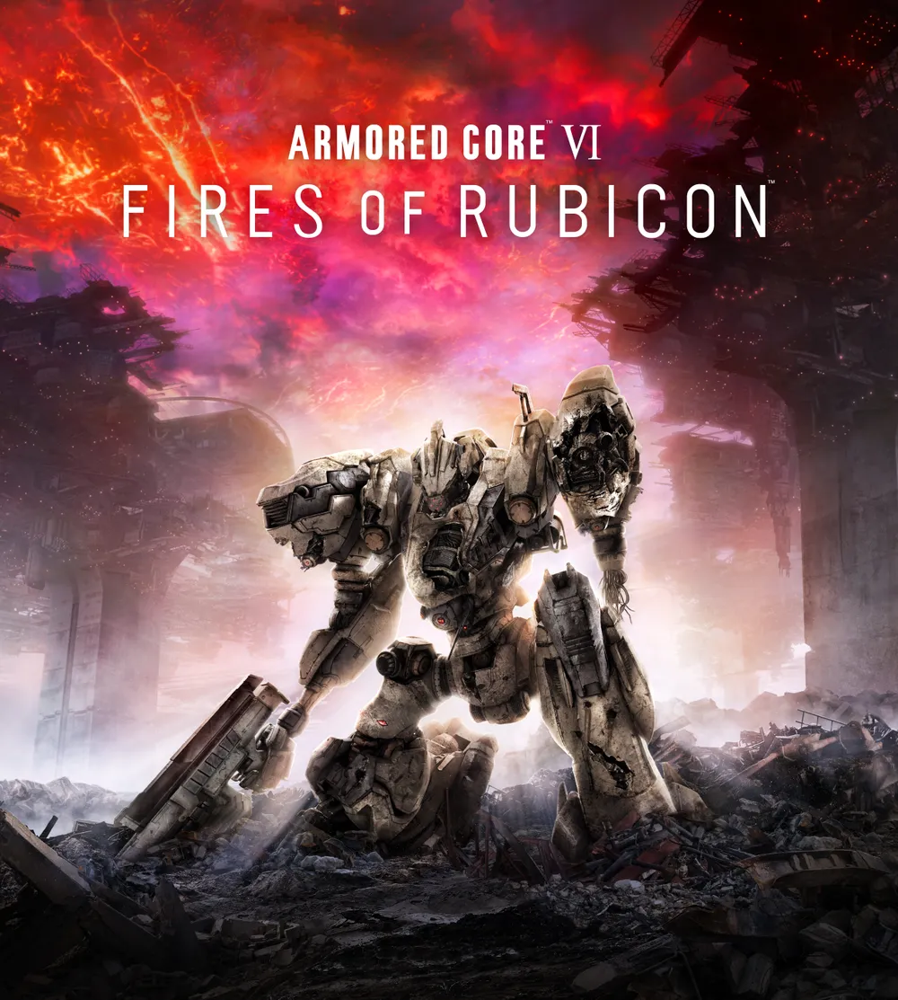

# 윤근수 프로젝트 계획서

[기업연계]언리얼 엔진을 활용한 게임 개발자 부트캠프 10기 윤근수

---

## 개요

- 본 프로젝트는 Unreal Engine 5.7 버전의 블루프린트를 이용해 제작한 3D 탑다운 게임이다.
- 플레이어는 WASD키를 이용해 캐릭터를 조작하며, 마우스를 이용해 조준 및 공격을 할 수 있다.
- 머리, 몸통, 팔, 다리의 파츠가 분리되어있고, 양 손에 다른 무기를 장착해 다양한 조합을 활용할 수 있다.
- 기본적으론 익스트렉션 슈팅을 기반으로 하나, 각 맵에 보스전을 넣어 소울라이크 보스전 또한 도입한다.

---

## 게임 컨셉

### 메인 컨셉

- Steam에서 구매 가능한 [Escape from Duckov](https://store.steampowered.com/app/3167020/Escape_from_Duckov/?l=koreana)의 쿼터뷰 익스트렉션 슈터 장르를 메인으로 한다.
- 맵을 탐험하며 적 처치 및 상자를 열어 보상을 획득해 해당 보상을 전투에 이용하거나 아이템 구매, 판매에 이용한다.
- 무기의 파츠를 교체해 커스터마이징 할 수 있다.
- 장비에 내구도가 있어 내구도가 다 달면 아이템을 사용할 수 없다.

### 디자인 컨셉

- Steam에서 구매 가능한 [아머드코어6 루비콘의 화염](https://store.steampowered.com/app/1888160/ARMORED_CORE_VI_FIRES_OF_RUBICON/)(이하 AC06)에서 디자인을 참고했다.
- AC06의 파츠 시스템을 참고해 머리, 몸통, 팔, 다리를 다른 파츠로 커스터마이징 가능하다.
- AC06의 무장 시스템을 참고해 양 손에 다른 무기를 착용할 수 있다.

---

## 핵심 플레이

### 이동 및 조작

- WASD 기반 8방향 이동
- 마우스 위치를 향한 캐릭터 이동
- 점프 시스템
- 회피(대쉬) 시스템

### 무기 시스템

- 다양한 원거리 무기 지원
  - 라이플
  - 샷건
  - 유탄 발사기
  - 로켓 런처
- 다양한 탄환 타입 지원
  - 일반 탄환
  - 폭발 탄환
  - 유도 탄환
- 양손 무기 시스템
  - 플레이어는 좌우 손에 다른 무기를 장착할 수 있다.
- 무기 파츠 커스터미이즈
  - 각 무기는 여러 파츠를 통해 성능을 변경할 수 있다.
- 모든 무기는 내구도를 가지고 있고, 내구도가 다 달면 사용할 수 없다.

### 적 시스템

- 일반 몬스터
- 특수 몬스터
- 보스 몬스터

### 성장 및 진행

- 맵 탐험
- 적 처치 및 상자로 보상 획득
- 장비 교체를 통한 전투 스타일 변화

### 기지 시스템

- 진행에 따라 기지 내부에서 할 수 있는 상호작용이 늘어남
- 아이템 판매 및 구매
- 맵에서 획득한 보상을 이용한 플레이어 자체 강화
  - 보상을 활용한 플레이어 자체의 스텟 상승

---

## 개발 목표

### 1. 기본적인 탑다운 액션 플레이 구현

### 2. 양손 무기 시스템 및 무기 시스템 구축

### 3. 다양한 적과 맵 콘텐츠 구현

### 4. 반복 플레이가 가능한 전투 중심 게임 완성

---

## 마일스톤

### 1. 플레이어 기본 조작 (0619~0620)

- 캐릭터 이동 [o]
- 마우스 조준 [o]
- 회전 시스템 [o]
- 점프 [o]
- 대쉬 [x]

### 2. 전투 시스템 (0621~0626)

- 무기 베이스 클래스 구축 [o]
- 탄환 시스템 구현 [o]
- 충돌 처리 [o]
- 체력 및 피해 시스템 구현 [o]
- 무기 파츠 시스템 구현 [x]

### 3. 적 AI (0627~0701)

- 적 이동 [o]
- 플레이어 추적 [o]
- 공격 패턴 [o]
- 사망 처리 [x]

### 4. 인벤토리 시스템 (0702~0706)

- 아이템 구매, 판매 가능
- 장비를 직접 수정 가능

### 5. 맵 시스템 (0707~0710)

- 기지 내부 구현
  - 아이템 구매 판매
  - 플레이어 강화
- 맵 구조 설계
- 적 스폰
- 스테이지 진행
- 보상 시스템

### 6. 콘텐츠 확장 (0711~0715)

- 무기 추가
- 특수 탄환 추가
- 보스 추가
- 밸런스 조정

### 7. 최종 마무리 (0716~)

- UI 개선
- 이펙트 및 사운드 추가
- 버그 수정
- 최종 테스트
